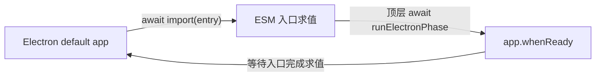

# Creative RSI Studio：Flash headless Main 真实验收报告

> 历史 epoch 注记（2026-08-16）：下述实网 `PASS` 发生在固定 `thinking=enabled`、`reasoning_effort=high`、单次总输出上限 `16,384` 的旧策略。当前代码已固定为 `32,768`，尚未完成本轮实网复验；因此本报告只能证明当时的历史 epoch，不能证明当前 `32,768` build 已通过。

## 结论

限定范围内的历史结论是 **`PASS`**：macOS arm64 当时的本地 headless build 已通过一次真实 DeepSeek Flash 创作、封存、跨进程恢复与本地取消边界验收。

- `selected / requested / returned model` 均严格等于 `deepseek-v4-flash`。
- DeepSeek SSE `[DONE]`、fingerprint、response ID 哈希和正数 usage 齐全；DSH rc.6 与 Controller provenance 完成闭环。
- 作品生成后，harness 提交固定测试修订并形成不可变封存版本；新 Electron 进程在零模型请求下恢复了相同作品和治理哈希。
- 本地 Loopback 请求进入 `STARTED` 后撤销 lease，得到 `LEASE_REVOKED`、零 completed request，且五秒内没有新增本地请求。
- Key 原文、DSH Session 类文件和 raw reasoning 字段的验收扫描命中均为 0。

这不是“整个应用已经通过”：本报告没有覆盖 Renderer、Preload/IPC 或 GUI；安装包、Windows、Pro、供应商侧取消、文学质量、Candidate/Evaluator 与 RSI 闭环也仍未验证。GUI 后续在同一旧 `16,384` 策略下取得了另一次 Computer Use operational PASS，见 [GUI 验收报告](260815-Computer-Use-GUI验收报告.md)，但仍不是可复现发布产物或真人验收。本次 headless 执行也未把忽略目录中的 `dist/**` 哈希写入 PASS JSON，因此只能表述为“clean HEAD 工作区当时 build 的历史 operational PASS”，不能表述为“commit `5670933` 的可复现发布产物已验证”，也不能外推为当前 `32,768` build 已验证。

## 验收范围与证据

| 项目 | 结果 | 可证明什么 | 不能证明什么 |
|---|---|---|---|
| 第三次授权的完整 Flash 验收 | 历史 PASS（`16,384` epoch） | 当时 headless build 的真实 Flash、safeStorage、DSH、Controller、封存、重启与本地取消边界跑通 | 不证明当前 `32,768` build、GUI、Pro、发布产物、供应商侧取消或作品质量 |
| 官方 `/models` | PASS | 同一应用链路确认 Flash 与 Pro 两个公开模型 ID 可用 | Pro 只被发现，没有调用 Chat |
| 第一次全链路尝试 | BLOCK | 旧 harness 会在外层截止后退出；没有把不完整执行误报为成功 | 当时阶段可观测性不足，不能断言具体停点或是否已请求 Chat |
| 第二次全链路尝试 | BLOCK | 在 clean commit `429f45f0f433abfba66cb34f69421a8afb946909` 上停在 `produce/boot`；后续三阶段均未运行 | 没有作品、usage、fingerprint、恢复或取消证据 |
| 无 Key、零模型 fetch/lease Electron 预检 | PASS | 独立 Electron 进程依次到达 `boot → electron-module-loaded → electron-ready → context-ready → shutdown` | 预检本身不证明实网创作或 OS 级零出网 |
| 自动与协议测试 | PASS | 启动、单实例、有界退出、Gateway、Controller、DSH Adapter 的离线合同成立 | 不证明普通用户体验或文学质量 |

## 本次 PASS 证据

```text
clean HEAD workspace: 5670933736139793e1156b618448ee7fb93acd10
working tree: clean
platform: darwin-arm64
Electron: 43.4.0
DSH: 0.1.0-rc.6
result: PASS

preflight:
  key file opened: false
  model API fetch attempts: 0
  model gateway leases issued: 0

credential:
  safeStorage live verified: true
  encrypted file mode: 0600
  plaintext loaded to environment: false

model:
  selected/requested/returned: deepseek-v4-flash
  system_fingerprint: a26a7955944dc5c60445bff77fac9c8e
  response_id_sha256: 04936640f02f53f707b99bbb2b1c4ca9828cbd6e85d3dce67b9cc16bc80de2e5
  request count: 1
  completed requests: 1
  failed requests: 0
  SSE DONE: true

usage:
  prompt_tokens: 207
  completion_tokens: 12286
  total_tokens: 12493
  cache_hit_tokens: 0
  cache_miss_tokens: 207

runtime:
  profile_sha256: 9b20aa1cfead71b82ffb0d6c0292e6097be7d4150b04887ace2195d525d81581
  controller authority: main-observed-model-gateway
  reasoning_content persisted: false

work:
  visible output UTF-8 bytes: 756
  output_sha256: 1982a32bdeacbcfc84049cc2774a465d95d169789e40261de231d26bae57f0aa
  edited_output_sha256: 3d70a2d44bc9b6c4217dc480d2405963705b224fb3368c1c0326828fa672e470
  sealed: true
  quality_status: NOT_EVALUATED
```

`completion_tokens` 是供应商 usage 字段，不是可见正文字数；作品只有 756 UTF-8 bytes，正文未进入报告。`quality_status=NOT_EVALUATED` 表示本次只证明流程和证据闭环，不证明文学质量。

重启恢复证据：新 Electron 进程成功解密 safeStorage；选择仍为 Flash；封存作品、harness 固定测试修订和治理哈希完全一致；恢复过程 `fetch=0 / lease=0`。

本地取消边界证据：运行状态为 `cancelled`；`request_count=1 / completed=0 / failed=1`；错误码为 `LEASE_REVOKED`；五秒内没有新增本地请求；上一份封存作品保持不变，中断 run 已关联。该门只观察到本地 Loopback 的 `STARTED`，不能证明 DeepSeek 已收到第二个请求，也不能证明零计费。

## 失败历史

- 第一次尝试只留下外层超时，阶段证据不足。
- 第二次尝试在 clean commit `429f45f0f433abfba66cb34f69421a8afb946909` 明确 BLOCK 于 `PHASE_HARD_TIMEOUT / produce / boot`，没有进入 `credential-read`。
- 离线复现确认根因是 Electron ESM 顶层等待环；`d9c32c1339f9534778b712da32ddca64caa50caa` 修复后，第三次授权运行取得本次 PASS。失败证据继续保留，没有被成功结果覆盖。

## 根因

根因是 Electron ESM 入口的等待环，而不是 DeepSeek 响应慢、DSH 运行失败或 Controller 写盘失败：



Electron 43 的 default app 会等待 ESM 入口加载完成；旧入口又在模块顶层等待 `app.whenReady()`。二者互相等待，所以最后一条可见证据只能是 `boot`。同一问题也存在于正式桌面 Main 入口，不能只修验收脚本。

## 已实施修复

修复提交：`d9c32c1339f9534778b712da32ddca64caa50caa`。

- live harness 不再在 ESM 顶层等待 Electron ready；pre-ready 错误只输出稳定错误码与阶段。
- 在打开 Key 文件描述符之前增加独立 `preflight`：禁止外网 fetch，要求模型 lease 为 0，并有界关闭。
- 增加 `electron-module-loaded` 检查点，使“模块加载”和“ready”可以分开定位。
- 正式桌面 Main 同步改为非阻塞 bootstrap，避免应用本体复现同一死锁。
- 正式应用增加 single-instance lock；第二实例只聚焦已有窗口，避免多个进程同时修改同一治理目录。
- 应用退出增加 15 秒上限；启动或关闭异常只报告固定脱敏错误码，并清理已创建资源。
- 临时目录与证据文件判断改为跨平台路径逻辑，不再写死 POSIX `/`。
- 本次验收后的复核发现 `dist/**` 未进入 source identity。本轮没有把“只能证明字节前后未变”的初版哈希方案并入门禁；后续必须由 fresh build 生成与 HEAD、lockfile 和实际工具链绑定的 manifest。

修复后的真实 Electron 预检结果：

```text
status: PASS
separate Electron process: true
key file opened: false
model API fetch attempts: 0
model gateway leases issued: 0
checkpoints: boot, electron-module-loaded, electron-ready, context-ready, shutdown
```

## 隐私与 Key 边界

- 外部 Key 文件权限为 `0600`；测试代码只机械读取唯一 `api_key` 字段，不 source 文件、不复制进仓库、不写环境变量或命令行。
- 预检在打开 Key 之前完成，并以 `fetch=0 / lease=0` 为硬门；正式阶段只通过文件描述符把 Key 交给 Main。
- safeStorage 已用真实 Key 加密并在新 Electron 进程中解密；DSH 与 Controller 只拿受限能力，不拿明文 Key。
- 本次临时状态、公开工作树、完整 Git 历史、当前环境与当前 argv 的 Key 原文 exact-match 命中均为 0。
- 公开树 full/tracked 审计通过；未发现 Session JSONL、checkpoint transcript 或 raw reasoning 持久化；live 进程和 live 临时目录均已清零。
- JavaScript 字符串无法承诺物理擦除；受信 DSH Node 进程仍没有 OS 级出网沙箱。这两项不因本次修复而改变。

## 离线验证结果

```text
Node contracts: 14 PASS
Model Gateway: 35 PASS
DSH Runtime Adapter: 14 PASS
Controller Bridge: 16 PASS
Desktop: 87 PASS
Python: 140 PASS
Skill quick_validate: PASS
Desktop build: PASS
DSH rc.6 published-runtime probe: PASS
public-tree tracked/full: PASS
```

## 状态边界

| 能力 | 本次状态 | 说明 |
|---|---|---|
| macOS arm64 旧 `16,384` headless build 的 Flash API 链路 | 历史实网 PASS | 只证明旧 epoch；当前 `32,768` build 尚待实网复验，也尚不满足 `FORWARD-TESTED` 的独立执行与可复现构建要求 |
| 当前 `32,768` Flash API 链路 | `UNVALIDATED` | 输出策略变化建立了新基线，不能沿用旧 `16,384` PASS |
| source-bound 可复现构建 | `UNVALIDATED` | fresh-build manifest 尚未实现；历史 PASS 只绑定 clean HEAD 工作区与当时的本地 build |
| Renderer / Preload / IPC / GUI | 本报告未覆盖 | 后续 macOS arm64 源码 build 已取得一次 Computer Use operational PASS；仍非真人、Windows 或 packaged app 验收 |
| Pro Chat | `UNVALIDATED` | `/models` 能发现 Pro，但没有调用 Pro |
| 供应商侧在途取消与零计费 | `UNVALIDATED` | 本次只证明本地 lease revoke 和五秒无新增本地请求 |
| macOS/Windows 安装包 | `UNVALIDATED` | 没有 DMG、EXE、portable ZIP 或 packaged smoke |
| OS 级 DSH 出网沙箱 | `UNVALIDATED` | 受信 Profile 不是操作系统网络隔离 |
| 文学质量与普通用户体验 | `UNVALIDATED` | `quality_status=NOT_EVALUATED`，也没有非程序员参与 |
| Candidate / Evaluator / 应用 RSI 闭环 | `PROPOSED` | 本次只覆盖 Production 首创作链路，不升级 M4–M6 |
