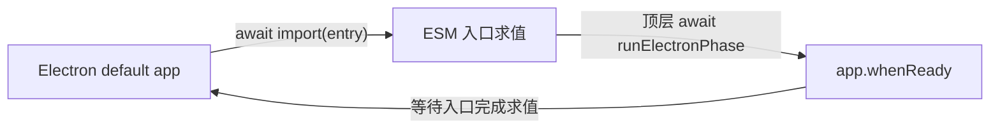

# Creative RSI Studio：Flash 真实验收报告

## 结论

本轮结论是 **`BLOCK`，不是 PASS**。

- DeepSeek 官方 `/models` 的维护者 Key 预检成功，观察到 `deepseek-v4-flash` 与 `deepseek-v4-pro` 两个公开模型 ID；这只能证明 Key 与模型发现接口可用。
- 完整的 `safeStorage → StudioService → DSH rc.6 → /chat/completions → Python Controller → 封存作品 → 重启恢复 → 在途取消` 链路没有取得成功证据。
- 第一次全链路尝试只留下外层超时，阶段可观测性不足；第二次的结构化证据明确为 `PHASE_HARD_TIMEOUT / produce / boot`。第二次所处阶段早于 `credential-read`，所以该次 Electron 子进程没有读取 Key，也没有发起 Chat 请求。旧版本源码与离线复现支持“两次同属启动死锁”的判断，但第一次不能被提升为逐阶段事实。
- 启动死锁已经在 `d9c32c1339f9534778b712da32ddca64caa50caa` 修复，并通过无 Key、无网络的真实 Electron 预检；本轮没有追加第三次官方 API 运行。因此 Flash 实网创作仍保持 `UNVALIDATED`。

不得从本报告推导以下结论：Flash 已经生成作品、DSH 已经完成真实 SSE、模型返回值与 fingerprint 已被验证、用户编辑可在真实调用后恢复，或取消后一定停止计费。

## 验收范围与证据

| 项目 | 结果 | 可证明什么 | 不能证明什么 |
|---|---|---|---|
| 官方 `/models` 预检 | 有限 PASS | 维护者 Key 可调用模型发现接口；返回两款公开模型 ID | 不证明 Chat、DSH、Controller、safeStorage 全链路 |
| 第一次全链路尝试 | BLOCK | 旧 harness 会在外层截止后退出；没有把不完整执行误报为成功 | 当时阶段可观测性不足，不能断言具体停点或是否已请求 Chat |
| 第二次全链路尝试 | BLOCK | 在 clean commit `429f45f0f433abfba66cb34f69421a8afb946909` 上停在 `produce/boot`；后续三阶段均未运行 | 没有作品、usage、fingerprint、恢复或取消证据 |
| 修复后 Electron 预检 | PASS（离线） | 独立 Electron 进程依次到达 `boot → electron-module-loaded → electron-ready → context-ready → shutdown` | 预检禁止打开 Key 和访问模型，不能替代实网创作 |
| 自动与协议测试 | PASS | 启动、单实例、有界退出、Gateway、Controller、DSH Adapter 的离线合同成立 | 不证明普通用户体验或文学质量 |

第二次尝试固定环境：

```text
source commit: 429f45f0f433abfba66cb34f69421a8afb946909
working tree: clean
platform: darwin-arm64
Electron: 43.4.0
DSH: 0.1.0-rc.6
result: BLOCK
error: PHASE_HARD_TIMEOUT
phase: produce
last checkpoint: boot
restart before cancel: SKIPPED
cancellation: SKIPPED
restart after cancel: SKIPPED
```

现场只检查到“封存验收凭据不存在、DSH Session/Transcript 类文件为 0”；没有读取或保留作品正文。

## 根因

根因是 Electron ESM 入口的等待环，而不是 DeepSeek 响应慢、DSH 运行失败或 Controller 写盘失败：



Electron 43 的 default app 会等待 ESM 入口加载完成；旧入口又在模块顶层等待 `app.whenReady()`。二者互相等待，所以最后一条可见证据只能是 `boot`。同一问题也存在于正式桌面 Main 入口，不能只修验收脚本。

## 已实施修复

修复提交：`d9c32c1339f9534778b712da32ddca64caa50caa`。

- live harness 不再在 ESM 顶层等待 Electron ready；pre-ready 错误只输出稳定错误码与阶段。
- 在打开 Key 文件描述符之前增加独立 `preflight`：禁止外网 fetch，要求模型 lease 为 0，并有界关闭。
- 增加 `electron-module-loaded` 检查点，使“模块加载”和“ready”可以分开定位。
- 正式桌面 Main 同步改为非阻塞 bootstrap，避免应用本体复现同一死锁。
- 正式应用增加 single-instance lock；第二实例只聚焦已有窗口，避免多个进程同时修改同一治理目录。
- 应用退出增加 15 秒上限；启动或关闭异常只报告固定脱敏错误码，并清理已创建资源。
- 临时目录与证据文件判断改为跨平台路径逻辑，不再写死 POSIX `/`。

修复后的真实 Electron 预检结果：

```text
status: PASS
separate Electron process: true
key file opened: false
model API fetch attempts: 0
model gateway leases issued: 0
checkpoints: boot, electron-module-loaded, electron-ready, context-ready, shutdown
```

## 隐私与 Key 边界

- 外部 Key 文件权限为 `0600`；测试代码只机械读取唯一 `api_key` 字段，不 source 文件、不复制进仓库、不写环境变量或命令行。
- 第二次全链路尝试的 Electron 子进程没有到达 `credential-read`；因此没有把 Key 载入 Renderer、DSH、Controller 或作品目录。
- 修复后预检在打开 Key 之前完成，并以 `fetch=0 / lease=0` 为硬门。
- 对当前工作树、完整 Git 历史、当前环境与当前 argv 做 Key 原文 exact-match 扫描，命中均为 0。
- 公开树 full/tracked 审计通过；未发现 Session JSONL、checkpoint transcript 或 raw reasoning 持久化。
- JavaScript 字符串无法承诺物理擦除；受信 DSH Node 进程仍没有 OS 级出网沙箱。这两项不因本次修复而改变。

## 离线验证结果

```text
Node contracts: 14 PASS
Model Gateway: 35 PASS
DSH Runtime Adapter: 14 PASS
Controller Bridge: 16 PASS
Desktop: 87 PASS
Python: 140 PASS
Skill quick_validate: PASS
Desktop build: PASS
DSH rc.6 published-runtime probe: PASS
public-tree tracked/full: PASS
```

## 下一次验收门

下一轮只能在新的 clean commit 上执行一次完整 Flash 验收，并必须同时满足：

1. 无 Key、无网络 preflight 先通过；
2. requested/returned model 都严格等于 `deepseek-v4-flash`；
3. fingerprint、response ID、正数 usage、SSE `[DONE]` 与 DSH 完成事件齐全；
4. Controller 的作品、RuntimeProvenance、review subject 与封存哈希互相一致；
5. 用户编辑在新 Electron 进程中精确恢复，恢复阶段模型请求为 0；
6. 在途取消必须留下 `LEASE_REVOKED`、零 completed request、无后续请求，并保留上一份封存作品；
7. Key 原文在 repo、历史、临时目录、环境、argv、DSH 与 Controller 中命中为 0。

在这七项全部通过前，README 和发布说明都必须继续写“Flash 实网创作 `UNVALIDATED`”。
