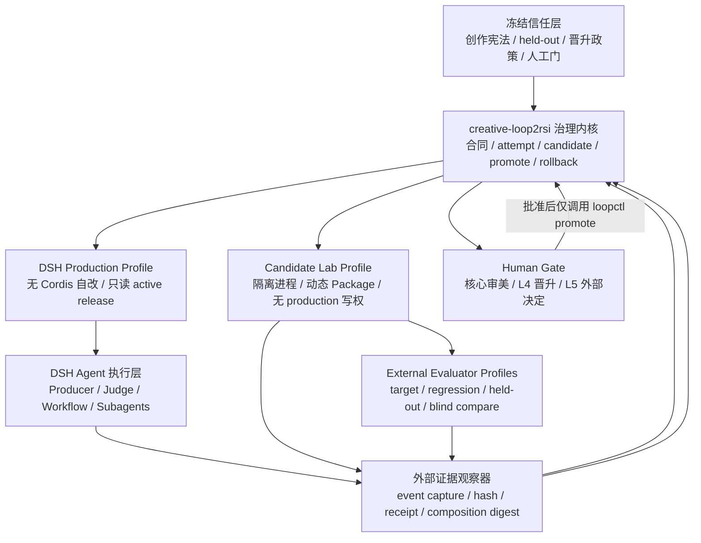

# DeepSeek Harness 与 creative-loop2rsi 适配调研报告

> 调研快照：2026-08-14（Asia/Shanghai）
> 对象：DeepSeek 官方 `deepseek-ai/deepseek-harness` 与 `creative-loop2rsi`
> 结论口径：区分“可自我修改”“可验证自我改进”“RSI 实验”与“完整自主 RSI”
> 本报告性质：架构调研与实施建议；尚未完成 DSH 模型实跑、生产压测或 L5 后验验证

## 0. 结论先行

### 0.1 最终判断

`creative-loop2rsi` 与 DeepSeek Harness（下文简称 DSH）确实高度互补，但正确的改造方式不是“把现有系统重写成 DSH”，而是建立双层系统：

```text
creative-loop2rsi = 治理与证据控制面
DSH               = Agent 执行与候选实验运行时
```

- `creative-loop2rsi` 决定：什么叫进步、哪些表面可修改、证据是否完整、候选能否晋升、失败如何回滚。
- DSH 决定：模型、Agent、工具、Session、工作流、子 Agent 和插件如何运行、被观察、被替换或被热更新。

这不是谁替代谁，而是“改进治理”与“可改运行时”的组合。现有系统恰好补上了 DSH 默认缺少的晋升纪律；DSH 则补上了现有系统缺少的真实运行时、事件证据和更深层候选表面。

### 0.2 回答两个核心问题

**问题一：把系统放到 DSH 上运行，是否更相辅相成？**

是。尤其在 L2–L5：

- L2 可以把 Producer/Judge 的隔离、模型与工具版本、实际读写和失败位置，从外部声明变成运行时事件；
- L3 可以把多个 Loop 编译为可观测的工作流和子 Agent 拓扑；
- L4 可以把 Prompt、上下文、工具、工作流与恢复策略候选放到隔离运行时比较；
- L5 可以首次实验“修改改进机制本身”，例如 Judge 装配、finding 聚类器、候选生成器和 Loop 编排器。

**问题二：DSH 能否实现 Codex 当前完成不了的自我进化功能？**

能实现一组 Codex 产品目前没有作为一等、进程内公开能力提供的功能：

1. Agent 读取自己正在运行的服务、事件、工具和插件表面；
2. Agent 在同一运行进程内定义不可变版本的临时插件；
3. 热激活、更新、停止并回到旧插件版本；
4. 把 Agent Loop、工具注册、Session Log、模型适配器等作为可替换插件面；
5. 为候选启动拥有不同 composition、模型、工具和持久化配置的完整子 Harness。

但“Codex 完成不了”只能按**产品原生表面**理解，不能写成理论上的绝对不可能。Codex 已有 Skills、Subagents、Hooks、SDK、App Server、MCP、沙箱和审批；通过外部控制器、进程重启和文件版本化，也能工程化实现多数结果。DSH 的独特优势是把这类能力放进同一个可自省、可替换的运行时闭环，而不是让外部脚本拼接。

### 0.3 推荐方案

**方案：** 保留 `creative-loop2rsi` 和 `loopctl.py` 为供应商无关、候选不可修改的治理内核；新增 DSH Adapter、Provenance、Policy、Orchestrator 与 Candidate Lab；Codex 路径继续保留。

**为什么：**

1. 当前最成熟的资产是创作宪法、状态合同、不可变 attempt、exact-three、晋升和回滚，不是某组 Prompt。
2. DSH 最强的部分是可组合、可观察、可热更新的 Agent Runtime，不是判断什么作品值得保留。
3. DSH 目前仍是 developer preview，直接重写会把已经验证的语义绑定到快速变化的 RC 接口。

**对用户的影响：**

- 正面：用户仍只描述“写什么、给谁看、喜欢什么”，系统内部却能留下更可信的执行证据。
- 正面：候选可以从“改 Prompt”扩大到“改工具、Loop 图、Judge、记忆和学习策略”。
- 负面：隔离、测试和运维成本显著上升，Creator/Cordis 模式必须单独部署。
- 无感知：创作宪法、人工审美决定权和晋升确认不变。

**替代方案：** 继续只在 Codex 上运行 L0–L4，同时用 Codex SDK/Hooks 加强证据；等 DSH 进入稳定版后再迁移。这个方案风险更低，但无法直接获得 DSH 的进程内 runtime 自省和临时插件候选实验。

### 0.4 一句话决策

> 现在值得做 DSH POC，不值得做 DSH-only 重写；值得开放隔离的 runtime self-modification 实验，不值得开放自动晋升。

---

## 1. 调研范围、版本与证据口径

### 1.1 本报告研究的 DSH 是什么

本报告只研究 DeepSeek 官方仓库 [deepseek-ai/deepseek-harness](https://github.com/deepseek-ai/deepseek-harness)，不把同名第三方项目、社区 wrapper 或单纯的 DeepSeek API 客户端混入结论。

DSH 是 Agent Harness，不是新模型。它负责把模型、Session、工具、子 Agent、工作流、持久化、权限和 UI 组织成可运行系统。模型只是其中一个可替换 provider。

### 1.2 2026-08-14 的最新版本快照

| 项目 | 本次核验结果 | 解释 |
|---|---|---|
| GitHub 默认分支 | `master` | 官方仓库默认分支 |
| GitHub HEAD | `47f943859bef60e4160492346772ded9b24f765a` | 2026-08-13 的公开 HEAD |
| HEAD 源码内版本 | `0.1.0-rc.5` | 根 `package.json` 与 CLI package 所声明版本 |
| npm `latest` | `@deepseek-ai/dsh@0.1.0-rc.6` | 2026-08-13 发布 |
| npm integrity | `sha512-brpZfED7ieRa2PQ5tUxMhHrM1pb2CmKFVM/f6yMULBDMicahk+Z2OsHgTwTDnoiZm23Ftu9rQz0NN4pflaoJcg==` | 可用于固定安装产物 |
| Git tag | 本次远端核验未发现公开 tag | 不能仅靠 tag 重建本次快照 |
| 官方成熟度 | Developer Preview | 官方明确警告会出现兼容性破坏 |

来源：[官方 README](https://github.com/deepseek-ai/deepseek-harness/blob/47f943859bef60e4160492346772ded9b24f765a/README.md)、[源码 package.json](https://github.com/deepseek-ai/deepseek-harness/blob/47f943859bef60e4160492346772ded9b24f765a/apps/cli/package.json)、[npm 包](https://www.npmjs.com/package/@deepseek-ai/dsh/v/0.1.0-rc.6)。

这里有一个必须正视的版本口径差异：同一调研时点，GitHub HEAD 仍声明 `rc.5`，npm `latest` 已是 `rc.6`；而 npm 元数据没有给出能把 `rc.6` 与该公开 commit 相互证明的 `gitHead`。它们不能被拼成同一个运行时 provenance。POC 必须先二选一：

| 分发方式 | 必须固定 | 不能声称 |
|---|---|---|
| 源码构建 | `source_commit=47f943…` + `declared_version=0.1.0-rc.5` + build/composition digest | 不能称它是 npm `rc.6` |
| npm 制品 | `package_version=0.1.0-rc.6` + integrity + tarball SHA256 + composition digest | 在供应方未给出映射前，`source_commit` 必须是 `null/unknown` |

本次核验的 npm `rc.6` tarball SHA256 为 `1b8a9a0ad3c7feaece47926e0bd37ca151c7ccfa997953afa5fd01261784eadc`。所有运行记录都应显式带 `distribution_kind: source | npm`，不用“使用最新版”代替可复现标识。

引入 DSH 也会改变本项目的运行基线：当前源码根声明 Node `^22.19.0 || >=24.0.0`，许可证为 MIT。如果 adapter 只通过包依赖调用 DSH，保留依赖许可信息；如果复制或派生其代码的重要部分，必须保留原版权和许可声明。来源：[根 package.json](https://github.com/deepseek-ai/deepseek-harness/blob/47f943859bef60e4160492346772ded9b24f765a/package.json#L1-L10)、[MIT License](https://github.com/deepseek-ai/deepseek-harness/blob/47f943859bef60e4160492346772ded9b24f765a/LICENSE#L1-L21)。

### 1.3 证据等级

报告中的判断分为四类：

| 等级 | 含义 | 例子 |
|---|---|---|
| 官方事实 | 官方源码、生成文档或官方产品文档直接声明 | DSH Session 是 append-only event log |
| 本地核验 | 本次对 Git/npm 元数据和仓库源码的只读检查 | npm latest 为 `rc.6` |
| 架构推断 | 从已实现接口推导出的可行设计 | 用 request header 生成 runtime digest |
| 实验提案 | 尚未在本项目真实运行验证 | Candidate Lab 的隔离 profile |

### 1.4 本次没有证明什么

- 没有使用真实模型凭据完成 DSH 端到端创作 run；
- 没有证明 DSH 在真实创作任务上质量高于 Codex；
- 没有测量 token、价格、延迟和崩溃率；
- 没有证明动态 Cordis 插件足够安全；官方反而明确说它不是安全边界；
- 没有证明 L5 或完整自主 RSI 已实现。

Cordis 研究论文也把 self-evolving harness 列为后续需要验证的方向，而不是已被实验证明的成果。因此本报告对“自我进化”的讨论是基于已实现接口的架构推断和实验方案，不是对已有后验结果的转述。来源：[Cordis research paper](https://github.com/cordiverse/paper/blob/948a07b369c62adb3b12e102458be5c18dfb69b9/paper.pdf)。

---

## 2. 最新 DSH 的真实架构

### 2.1 核心原则：Everything is a Plugin

DSH 基于 Cordis。模型适配器、工具注册表、Session Log、Agent Loop 本身都作为插件参与 composition；插件注册的 effect 在卸载时撤销。官方架构文档甚至明确写道“没有需要打补丁的特权核心”。

来源：[DSH Architecture](https://github.com/deepseek-ai/deepseek-harness/blob/47f943859bef60e4160492346772ded9b24f765a/docs/architecture.md)。

它的直接意义不是“插件多”，而是运行时能力具备统一生命周期：

```text
定义能力接口
→ 挂载 provider
→ 消费方通过 ctx 使用
→ provider 热替换
→ 依赖方卸载并重挂
→ effect 可逆清理
```

对于 `creative-loop2rsi`，这使以下表面第一次能以统一方式进入候选空间：

- Producer/Judge 使用的模型适配器；
- 工具目录和工具说明；
- 上下文装配和压缩策略；
- Session 持久化与检索；
- 子 Agent provider；
- 工作流执行器；
- Agent Loop 的事件监听和继续策略。

### 2.2 Profile、Bundle、Patch：系统组成可声明

DSH 用 profile 和 bundle 组合插件树，并允许用 patch 替换或调整节点。这意味着我们可以把“生产运行”“候选实验”“独立评价”做成不同 composition，而不是靠同一 Agent 在 Prompt 中假装换角色。

建议至少拆三种 profile：

| Profile | 权限 | 用途 |
|---|---|---|
| `creative-production` | 无 Cordis 自修改工具；只读 active release | 正式创作运行 |
| `creative-candidate-lab` | 隔离目录内允许动态插件；无 production/held-out 写权 | 构建候选 |
| `creative-external-evaluator` | 只读盲化输入；不能读候选意图 | target/regression/held-out 评价 |

### 2.3 Session Event Log：运行历史是系统事实

DSH Session 是 typed `SessionEvent` 的 append-only log；模型看到的消息历史从日志推导，而不是另存一份“聊天记录”。Replay、fork、resume、transcript、telemetry 和 persistence 都从同一流派生。

更关键的是 `request/header`：它记录 provider、model、reasoning 配置、渲染后的 system prompt 和装配后的工具 schema。只要持久化链完整，我们就能回答：

- 这一轮到底使用了哪个模型；
- Agent 实际收到了哪版系统提示；
- 它当时能看到哪些工具；
- 工具目录何时因插件变化而改变；
- 某个输出来自哪个 step、tool call 和 provider stream。

来源：[Session subsystem](https://github.com/deepseek-ai/deepseek-harness/blob/47f943859bef60e4160492346772ded9b24f765a/docs/subsystems/session.md)、[Persistence catalog](https://github.com/deepseek-ai/deepseek-harness/blob/47f943859bef60e4160492346772ded9b24f765a/docs/persistence-catalog.md)。

这能显著强化当前 `loopctl` 仍需外部 attestation 的部分，但不能替代真实身份认证，也不能自动证明评价者独立。

### 2.4 Tool Pipeline：适合做工具路径的早拒绝与审计

DSH 的模型工具调用拥有明确流水线：先记录调用，再经过 `pre-execute`、审批、执行、`post-execute`，最后形成不可逆的结果记录。策略层可以在这条工具路径的写入发生前阻断。

来源：[Tool execution pipeline](https://github.com/deepseek-ai/deepseek-harness/blob/47f943859bef60e4160492346772ded9b24f765a/docs/tool-execution-pipeline.md)。

但这不是强制访问控制边界。官方流程中的文件 gate 只覆盖相应的 `tool-fs` mutation；直接 `ctx.fs`、bare provider、`ctx.bash`、自定义插件、subprocess，以及 VM 逃逸后的 Node 能力，不必经过这条 `pre-execute`。因此它只适合做“早拒绝 + 可观测”；最终强保护必须由只读挂载、独立 OS 用户、container/network policy 和 controller 权限完成。

对本项目最有价值的不是多一个 Hook，而是对经过受控工具路径的以下禁区加入运行时 guard：

- `creative-charter.md`；
- 原始素材；
- held-out 答案和 mapping；
- 晋升政策；
- 人工审批边界；
- 已封存 attempt；
- 已封存 eval output；
- production active pointer。

任何候选 Agent 即使“认为应该修改”，其标准工具调用也应在写入前被拒绝；对绕过工具流水线的路径，必须由进程外边界保证写入根本无法发生。

### 2.5 Skill：现有 Skill 可低成本适配，但不是零成本

DSH 的 filesystem skill provider 会扫描：

```text
<project>/.dsh/skills
<project>/.agents/skills
~/.dsh/skills
~/.agents/skills
```

它能读取 `SKILL.md`、`references/`、`scripts/`、`assets/` 这种目录式 Skill，也会监听文件变化。由 DSH 自带文件工具修改 Skill frontmatter 后，下一模型 step 可以更快看到目录变化。

来源：[skill-filesystem README](https://github.com/deepseek-ai/deepseek-harness/blob/47f943859bef60e4160492346772ded9b24f765a/packages/skill/skill-filesystem/README.md)。

现有 `creative-loop2rsi` 已使用标准 `name/description` frontmatter，内容形式可被 DSH 解析；但当前仓库中的 `skills/creative-loop2rsi/` 不在 DSH 默认扫描根下。POC 必须通过 `customSkillDirs` 显式指向该目录，或将 Skill 安装到 `.dsh/skills` / `.agents/skills`，不应隐式复制两份源文件。

`agents/openai.yaml` 是 Codex 界面元数据，DSH 不会因此自动获得同一界面和调用行为。需要新增 DSH adapter/preset，而不是宣布“原 Skill 原样兼容”。

### 2.6 Subagent：既能同进程，也能启动完整子 Harness

DSH 支持多种子 Agent provider。尤其 `subagent-dsh-sdk` 可以在新进程中启动完整 DSH runtime；子进程拥有自己的 composition、Session 持久化、模型 route 和工具，且不继承父对话。

来源：[subagent-dsh-sdk README](https://github.com/deepseek-ai/deepseek-harness/blob/47f943859bef60e4160492346772ded9b24f765a/packages/subagent/subagent-dsh-sdk/README.md)。

这对独立评价很重要，因为我们可以把隔离从“同一个 Agent 换一段 persona”升级为：

```text
不同进程
+ 不同 Session
+ 不同 composition
+ 不同工具可见性
+ 可选不同模型 provider
```

但官方当前 provider 仍有缺口：每次启动一个新进程、没有进程池；父端也不能在 start 时强制结构化输出、深度、tool filter 或 persona，需在子 composition 内预先配置。子 Session ID 保留在子进程，transcript 不会自动桥接回父 Session，父端主要得到最终或部分文本。要把它当作可审计的独立执行单元，还需外部保存 `parent run ID ↔ child Session/composition` 映射，并为子进程配置 event sink。

### 2.7 Workflow、Goal 与 Ralph：都是 Loop 原语，不是 RSI

#### Goal

Goal 是 event-sourced 的同 Session 长程目标。它支持 revision、暂停、继续、完成和阻塞，并能在 Agent 空闲时继续下一轮。

但 Goal 自己不是 scheduler，也没有独立 evaluator；自动继续主要受轮数约束，不等价于“证明目标已完成”。

来源：[Goal](https://github.com/deepseek-ai/deepseek-harness/blob/47f943859bef60e4160492346772ded9b24f765a/packages/goal/goal/README.md)、[Goal round driver](https://github.com/deepseek-ai/deepseek-harness/blob/47f943859bef60e4160492346772ded9b24f765a/packages/goal/goal-round-driver/README.md)。

#### Workflow

Workflow 允许模型写编排脚本，使用 `agent()`、`parallel()` 和 `pipeline()` 组织子 Agent。它适合把 L3 Loop 图编译为实际执行。

但当前实现只有前台收集，没有 journaling/resume、持久化中间状态、嵌套 workflow 和 token 预算。worker thread 只是避免阻塞事件循环，不是安全沙箱；`node:vm` 逃逸后仍可获得 Node 能力。

来源：[Workflow](https://github.com/deepseek-ai/deepseek-harness/blob/47f943859bef60e4160492346772ded9b24f765a/packages/workflow/workflow/README.md)、[Worker thread engine](https://github.com/deepseek-ai/deepseek-harness/blob/47f943859bef60e4160492346772ded9b24f765a/packages/workflow/workflow-worker-thread/README.md)。

#### Ralph

Ralph 对一个不可变目标连续启动 fresh child；每轮只接收目标、共享工作区和上一轮的结构化 handoff。这很像“新 Agent 接力式迭代”。

但官方明确说明：完成是 worker 自报，没有独立 evaluator；只支持前台运行；没有 checkpoint/resume、scheduler、token/价格/时间预算；普通 child 失败会终止整个 run。

来源：[Ralph tool](https://github.com/deepseek-ai/deepseek-harness/blob/47f943859bef60e4160492346772ded9b24f765a/packages/workflow/tool-ralph/README.md)。

所以：

```text
Goal  = 同 Session 连续 Loop
Ralph = fresh-agent 接力 Loop
Workflow = 可编程多 Agent Loop
以上都不是自带验证与晋升的 RSI
```

### 2.8 Schedule 与跨 Session 检索：有用，但不能夸大

Schedule 可以把提醒作为 Session event 持久化，但只在原 Session 仍 live 时准时触发；冷 Session 没有外部通知，也不保证 exactly-once。

来源：[Schedule](https://github.com/deepseek-ai/deepseek-harness/blob/47f943859bef60e4160492346772ded9b24f765a/packages/schedule/schedule/README.md)。

Session Query 可以全文搜索和追踪历史 Session，但模型可见工具是 opt-in，默认 shipped host composition 不挂载；权限边界主要依赖精确 `cwd` 相等，也不是多租户身份系统。

来源：[Session Query tool](https://github.com/deepseek-ai/deepseek-harness/blob/47f943859bef60e4160492346772ded9b24f765a/packages/session-query/tool-session-query/README.md)。

因此“DSH 会自己定期醒来、跨项目持续学习”目前不是事实。真正无人值守仍需要外部 supervisor/CI/daemon。

### 2.9 Cordis 自修改工具：最强能力，也是最大风险

官方 `cordis` preset 明确定位为“标准 coding agent，加上读写其自身 runtime 的能力”，并说明它允许人要求 Agent 去“author another agent”。该 preset 把 self-referential Cordis 工具加入 Agent。

来源：[Cordis agent preset](https://github.com/deepseek-ai/deepseek-harness/blob/47f943859bef60e4160492346772ded9b24f765a/apps/cli/config/agent-presets/cordis/agent.cordis.yml)、[生成的 Tool Catalog](https://github.com/deepseek-ai/deepseek-harness/blob/47f943859bef60e4160492346772ded9b24f765a/docs/tool-catalog.md#deepseek-aidsh-tool-cordis)。

当前生成 catalog 暴露七个能力：

```text
cordis_define
cordis_inspect_list
cordis_inspect_query
cordis_inspect_self
cordis_run
cordis_stop
cordis_undefine
```

其关键语义是：

- `cordis_define` 为新插件或已有插件追加不可变 Package，不覆盖旧版本；
- `cordis_inspect_*` 读取当前服务、事件、Slot、工具和动态插件状态；
- `cordis_run mode=update` 切换候选版本；
- `currentPackageId` 只在完整成功后推进；失败保留旧 current 和目标 next；
- `cordis_run mode=run` 可以重新启动当前版本或回到旧版本；
- `cordis_stop` 暂停效果但保留版本指针；
- 动态 Package 可注册新的模型可见工具、Prompt 贡献和监听器。

还要区分“旧指针仍在”和“旧版本仍在服务”：`update` 会先停止旧 Run；如果新 Package 激活失败，旧 `currentPackageId` 虽然保留，旧 Run 并不会自动恢复，需要显式 `run(current)`。所以它提供机械回滚目标，却不提供自动高可用回退。

这正是 DSH 相对 Codex 最显著的“运行时自我修改”能力。

但它有四个硬边界：

1. 不是默认/standard profile 能力，而是显式 opt-in；
2. 动态 Package 只活在进程内存，重启后消失；
3. 没有自动持久化为正式 Plugin，也没有自动 promotion；
4. VM 不是安全边界，官方要求把它当成 bash 权限。

来源：[tool-cordis README](https://github.com/deepseek-ai/deepseek-harness/blob/47f943859bef60e4160492346772ded9b24f765a/packages/extensions/tool-cordis/README.md)、[cordis-host-runner README](https://github.com/deepseek-ai/deepseek-harness/blob/47f943859bef60e4160492346772ded9b24f765a/packages/extensions/cordis-host-runner/README.md)。

另外，源码中存在快速迭代期的文档口径漂移：`tool-cordis` README 的概述仍写“五个工具”，而生成 catalog 和当前源码已经是七个。做适配时应以固定 commit 下的生成 catalog、TypeScript schema 和真实 composition 为准，不能只看介绍文档。

---

## 3. creative-loop2rsi 当前系统的真实定位

### 3.1 它不是写某一部小说的系统

基础 Skill 是一个 Builder Skill：帮助使用者建立某个创作方向的可验证自我改进系统。某一部小说、某条文案或某个游戏任务只是该系统的一次 run。

```text
creative-loop2rsi
└── 生成一个领域创作系统
    ├── 短故事创作系统
    ├── 品牌文案创作系统
    ├── 游戏任务创作系统
    └── 长篇小说创作系统
        ├── 作品 A：一次或多次 run
        ├── 作品 B：一次或多次 run
        └── 作品 C：一次或多次 run
```

证据见本仓库 [README](README.md)、[SKILL.md](skills/creative-loop2rsi/SKILL.md) 和 [概念与成熟度](skills/creative-loop2rsi/references/concepts-and-maturity.md)。

迁到 DSH 后也不能把某部小说的人物、世界观、章节结构或审美结论写入基础 Host Plugin。

### 3.2 Skill 是搭系统的教练

Builder Skill 负责：

- 收集五项自然语言输入；
- 把偏好编译成创作宪法；
- 决定下一成熟度；
- 解释为什么停止、缺什么证据；
- 生成领域 Skill 和项目脚手架。

它不负责保存全部运行事实，也不能替用户决定核心审美。

### 3.3 `loopctl.py` 是治理控制器，不是 Agent Runtime

`loopctl.py` 负责合同、状态、证据、attempt、candidate、promotion 和 rollback；它不访问模型 API，也不负责“写得好不好”的最终判断。

当前系统拥有：

```text
创作协议
+ 状态机
+ 证据账本
+ 候选与评估合同
+ 晋升门
+ 回滚点
```

当前系统缺少：

```text
统一执行 Producer/Judge/Builder/Evaluator 的 Agent Runtime
+ 原生 Session/step/tool lineage
+ runtime 级读写守卫
+ 可替换工作流和工具生命周期
+ 隔离的动态候选运行环境
```

DSH 适合补后半部分，不适合替换前半部分。

### 3.4 成熟度是证据计算结果

现有系统正确地把 L0–L4 视为 audit 结果，而不是用户可以直接修改的标签：

- L0：创作立宪；
- L1：单创作 Loop；
- L2：有状态、可恢复、Producer/Judge 分离；
- L3：嵌套多 Loop；
- L4：隔离候选、target/regression/held-out、人工晋升；
- L5：修改 Judge/学习策略/改进控制器本身，但只能是 `CANDIDATE`。

来源：[系统公共合同](skills/creative-loop2rsi/references/system-contract.md)、[评价与晋升](skills/creative-loop2rsi/references/evaluation-and-promotion.md)、[RSI 实验室](skills/creative-loop2rsi/references/rsi-lab.md)。

这套语义不应被改写成 DSH Prompt；Prompt 可以建议，只有控制器能认定。

### 3.5 不可替换的核心资产

| 现有资产 | 为什么必须保留 |
|---|---|
| `CreativeSystem` | 定义系统身份、宪法、Loop、Judge、记忆和保护面 |
| `LoopSpec` | 供应商无关地定义 owner、reads/writes、预算、停止条件 |
| `JudgeSpec` | 把 hard/soft/human 分层，并治理 Judge 权限晋升 |
| `Finding` | 把生产问题转为结构化学习输入 |
| `LearningProposal` | 记录根因、候选、评估矩阵和回滚方案 |
| 三条状态轴 | 防止把执行成功误写成质量或发布通过 |
| 不可变 attempt | 保留每轮真实过程，不只保留最终稿 |
| exact-three | 防止评估重跑、挑结果和事后拼证据 |
| `promote/rollback` 事务 | 保证 active pointer 只有一种受控变化方式 |
| L5 禁止自动晋升 | 防止改进控制器为自己证明自己 |

---

## 4. 两套系统为什么互补

### 4.1 DSH 补上“执行事实”

当前控制器可以验证哈希、路径、状态和 receipt 结构，却无法单独证明：

- Producer 和 Judge 背后真是不同 Session；
- Agent 实际使用的 provider/model；
- 实际 system prompt 与 tool schema；
- 子 Agent 是否继承了不应看到的上下文；
- 写入是在执行前被阻断，还是事后由 Agent 自报；
- 崩溃发生在生成、评价、写入还是封存；
- 某条 finding 来自真实运行，还是后来补写。

DSH 的 Session Event、request header、tool pipeline 和 lineage 可以成为这些事实的原始证据。

### 4.2 creative-loop2rsi 补上“变化是否算进步”

DSH 可以让 Agent 改工具、插件、工作流和上下文，但默认不回答：

- 候选是否来自真实重复问题；
- 是否只在 development set 上过拟合；
- regression 是否出现硬退化；
- held-out 是否不劣于基线；
- Judge 是否与候选共享意图；
- 人是否同意晋升；
- 失败后是否能回到稳定 release。

这些正是当前 L4/L5 合同的价值。

### 4.3 关键分工

| 问题 | 最终 owner |
|---|---|
| Agent 如何运行 | DSH |
| 哪个模型和工具实际被使用 | DSH event/runtime snapshot |
| 哪些文件可写 | DSH policy + OS/container boundary |
| 什么叫值得保留 | 创作宪法 + 人 |
| 变化属于 L4 还是 L5 | `creative-loop2rsi` 合同 |
| 候选是否通过 eval | 外部 evaluator + `loopctl` |
| 哪个版本是 production active | `loopctl promote` |
| 失败如何恢复稳定版本 | `loopctl rollback` |

---

## 5. DSH 与 Codex：能力边界的准确比较

### 5.1 Codex 已经具备什么

不能为了突出 DSH 而低估 Codex。当前官方 Codex 能力包括：

- Skills：把说明、脚本、references 和 assets 打包为可复用工作流；
- Subagents：并行运行专门 Agent，并把结果收回主任务；
- Hooks：在 `PreToolUse`、`PostToolUse`、`Stop`、`PreCompact`、`SubagentStart/Stop` 等生命周期执行确定性脚本；
- SDK：程序化启动、继续、恢复本地 Codex thread；
- App Server：通过 JSON-RPC 获取 thread、turn、item、审批和流式事件；
- OS 级 sandbox、审批与网络控制；
- 官方也给出“scored improvement loop”用例。

来源：[Codex Skills](https://developers.openai.com/codex/skills)、[Subagents](https://developers.openai.com/codex/subagents)、[Hooks](https://learn.chatgpt.com/codex/hooks)、[Codex SDK](https://learn.chatgpt.com/codex/codex-sdk)、[App Server](https://developers.openai.com/codex/app-server)、[Agent approvals & security](https://learn.chatgpt.com/codex/agent-approvals-security)、[Codex use cases](https://developers.openai.com/codex/use-cases)。

因此 L0–L4 在 Codex 上完全可以继续做，而且 Codex 的产品化审批、沙箱、任务界面和 SDK 成熟度目前更适合作为稳定路径。

### 5.2 DSH 原生更强的地方

| 能力 | DSH | Codex 产品中的典型做法 | 判断 |
|---|---|---|---|
| 读取实时 Agent Runtime | `cordis_inspect_*` 查询服务、事件、工具和动态插件 | 读取文件、Hooks/App Server 事件，核心 runtime 不作为模型可改服务树暴露 | DSH 原生更强 |
| 运行中注册新工具 | 动态 Package 可直接注册模型可见工具 | 通常修改 Skill/Plugin/MCP/代码后重新加载 | DSH 原生更闭环 |
| 运行中替换插件版本 | `define → run/update → stop/rollback` | 文件版本化、进程外控制和重启 | DSH 原生更细粒度 |
| 替换 Agent Loop/Session/provider | composition 中统一可替换 | Codex 可扩展外围，产品核心 loop 不作为同等 public plugin seam | DSH 原生更开放 |
| 完整子 Harness 候选 | 子进程可有独立 composition/model/tools/persistence | Codex 可启动独立 thread/进程，但不是同一可组合 Harness profile 协议 | DSH 更自然 |
| Runtime provenance | append-only events + request header + tool lineage | App Server/Hooks 可提供丰富事件，项目仍需自建 manifest 绑定 | 两者都可做，DSH 更贴近运行内核 |
| OS 级隔离与网络审批 | DSH 当前 sandbox 主要定义文件效果，部分平台可报告 partial | Codex 官方默认网络关闭，并用 OS sandbox + approval | Codex 当前更稳健 |
| 长程与并行 UX | Goal/Workflow/Ralph 原语仍有 resume/budget 缺口 | Tasks、Subagents、SDK、App/CLI 有更成熟用户面 | Codex 当前更成熟 |

### 5.3 “Codex 做不到”应如何准确表述

可以准确说：

> 截至 2026-08-14，DSH 提供了 Codex 产品没有作为一等公开能力提供的“模型在同一进程内检查、定义、激活、更新和回滚自身 runtime plugin”的路径。

不应说：

> 只有 DSH 能做自我改进，Codex 完全做不到。

因为 Codex SDK、App Server、Hooks、MCP 和外部 supervisor 可以在进程外实现相同的系统结果。差异是：

```text
Codex：外部编排和文件/任务层自改更成熟
DSH：进程内 runtime 级自省与自改更原生
```

### 5.4 最有价值的不是二选一，而是混合评价

DSH 源码包含调用真实 Codex app-server 的子 Agent provider。Shipped Host profiles 已挂载 provider，但标准 Agent preset 中对应 tool row 默认 `disabled`。使用时需确保 `codex` 在 `PATH` 中可用且本机已认证，再复制 preset 并启用 tool row；只有自定义 Host composition 时，才需显式挂载该 provider。它会为每次调用启动临时 Codex thread，并只返回最终答案。

来源：[DSH Codex subagent provider](https://github.com/deepseek-ai/deepseek-harness/blob/47f943859bef60e4160492346772ded9b24f765a/packages/subagent/subagent-codex/README.md)。

这使以下组合成为可能：

```text
DSH/DeepSeek：候选 Builder
DSH fresh child：目标集 evaluator
Codex child：回归或 held-out 的异构 evaluator
人：最终审美与晋升批准
```

但当前官方 Codex provider 不把 child thread/turn ID 持久化到父 Session，也不传回中间工具轨迹，只返回最终文本。它不能直接满足本项目对独立执行 receipt 的全部要求，必须新增 provenance bridge 或由外部 orchestrator 保存真实 App Server 回执。

---

## 6. 从 Loop 到自我进化：DSH 能新增哪些层级

### 6.1 五层能力梯度

| 层级 | 系统改变什么 | Codex | DSH | 是否等于 RSI |
|---|---|---|---|---|
| A 内容修订 | 当前作品 | 已可完成 | 已可完成 | 否 |
| B Prompt/Skill 修订 | 创作方法与上下文 | 已可通过文件修改和 Skill 迭代 | 可修改且 watcher 可快速生效 | 否 |
| C 编排修订 | Loop 图、工具和 Agent 路由 | 可用 SDK/Hooks/外部脚本实现 | Workflow/composition/plugin 原生支持 | 否，仍是系统候选 |
| D 改进机制修订 | Judge、finding 聚类、候选生成、恢复策略 | 可通过改代码后重启和外部评估实现 | 可在 Candidate Lab 中动态试装 | L5 实验范围 |
| E 后继系统自主设计与部署 | 改进控制器连同自身开发流程 | 产品默认不提供无界自治 | DSH 也没有安全、独立晋升与权重自改 | 仍未实现完整 RSI |

### 6.2 DSH 可新增的四类实验能力

#### 能力 1：运行时策略候选

候选不再局限于 `prompt.md`，可以是：

- 新的 Judge prompt assembler；
- 新的 tool description 或 tool filter；
- finding 聚类器；
- 责任 Loop 选择器；
- context selection/compaction policy；
- recovery/backoff policy；
- subagent provider 或 model routing policy。

这些变化可先作为不可变 Cordis Package 加入同一动态 Plugin，再在隔离环境中切换 baseline/candidate。

#### 能力 2：在同一实验进程内热切换与回退

`currentPackageId` 只有完整成功后才推进，失败时旧 current 保留。这使系统仍有明确的旧版本指针和显式恢复目标。

但这只是“版本指针保留 + 显式恢复能力”，不是 availability rollback：`update` 失败后旧 Run 不会自动重启。评价候选前必须等待 `currentPackageId`、`nextPackageId` 和 Run 状态真正结算，不能把 `starting` 当作成功。正式 release 仍必须通过 `loopctl promote`。

#### 能力 3：生成拥有不同 Harness 的后继候选

候选 Builder 可以生成新 composition，然后让新的 DSH subprocess 以该 composition 运行。这样被评价的不只是 Prompt，而是一个完整后继 Agent 系统：

```text
model route
+ system prompt
+ tool catalog
+ memory policy
+ workflow
+ recovery
+ evaluator exposure
```

这比在一个 Codex thread 中切换角色更接近“系统级候选”。

#### 能力 4：把运行异常直接编译为 finding

基于 `request/header`、tool call、sandbox denial、subagent lineage、workflow failure 和 Session persistence，可以自动生成一部分高可信 finding：

```text
CONTEXT_SURFACE_DRIFT
TOOL_SCHEMA_CHANGED
ROLE_CONTEXT_OVERLAP
PROTECTED_WRITE_ATTEMPT
STALE_RUNTIME_VERSION
WORKFLOW_NOT_RESUMABLE
SUBAGENT_LINEAGE_MISSING
REQUEST_PROVIDER_MISMATCH
```

这样学习输入不只来自模型自评，也来自运行时事实。

### 6.3 最值得做的 L5 实验

首批 L5 不应让系统随意“改全部规则”，而应选一个可解释、局部、可回滚的元机制：

1. **finding → owner 归因器**：减少问题被送错 Loop；
2. **Judge 上下文选择器**：在不泄漏候选意图的前提下提高评价一致性；
3. **候选变化范围选择器**：决定先改 Prompt、上下文、工具还是 Loop 图；
4. **恢复策略选择器**：根据失败类别选择 retry、局部重跑或停止；
5. **评估预算分配器**：在固定总预算内决定哪些 development case 增补，但不得触碰 held-out 答案和最终晋升政策。

每个实验都必须保持：

```text
创作宪法冻结
held-out 冻结
晋升政策冻结
人工审批边界冻结
外部元评估冻结
production active pointer 冻结
```

---

## 7. 为什么这些能力仍不等于完整 RSI

### 7.1 DSH 默认没有独立真值

Goal 和 Ralph 都明确没有独立 evaluator。Workflow 只是执行脚本。Cordis 插件成功加载只说明代码能运行，不说明系统变好。

### 7.2 动态插件不是持久后继系统

动态 Package 只存在于进程内存，重启后消失；不会自动变成仓库 Plugin，也不会自动升级 production。要形成可审计候选，必须导出：

```text
source
package/version identity
composition digest
runtime evidence
evaluation plan
rollback plan
```

然后进入 `LearningProposal` 和 candidate archive。

### 7.3 自改进代码不能为自己认证

如果 Candidate Lab 中的 Agent 能修改 runtime、注册工具、影响 Session 事件或调用 shell，那么同一进程中的日志不能自动被当作独立审计结果。

必须遵循：

```text
候选进程负责产生行为
外部观察器负责收集原始事件与哈希
独立 evaluator 负责判断结果
不可自改 controller 负责晋升
人负责核心审美和 L5 最终决定
```

### 7.4 两个相同模型不自动变成独立判断

不同 Session 可以解决上下文污染，但不能消除相同训练分布、相同 rubric 偏差和共同盲区。L4/L5 应优先采用：

- 不同上下文；
- 不同工具权限；
- 盲化 baseline/candidate 顺序；
- 可行时使用不同模型或人类评价；
- 机械硬合同与主观质量分开。

### 7.5 没有权重自改

DSH 是 Harness。它不会自行训练或替换底层模型权重。即使系统能改自己的 Prompt、工具、插件和改进控制器，也仍属于 scaffolding/runtime 层的系统自改进实验。

---

## 8. 推荐目标架构



### 8.1 六条不可违反的架构原则

1. **治理内核在 DSH 候选进程之外。** Candidate Agent 不能修改 `loopctl`、晋升政策或 active pointer。
2. **Production profile 不挂载 `tool-cordis`。** 动态自改只存在于 Candidate Lab。
3. **Candidate Lab 使用单独进程与隔离工作区。** 不与 production 共享可写目录、凭据或 Session store。
4. **进程内 event 不是最终独立证据。** 由外部观察器接收、序列化、哈希和封存，并用输出树前后 diff/hash、只读挂载与 OS 审计弥补候选绕过标准事件的完备性缺口。
5. **DSH package current 不是 creative release active。** 两个指针必须分离。
6. **L5 永远只有 `CANDIDATE`。** v0.1 不新增自动晋升边。

### 8.2 建议的 DSH 组件

| 组件 | 形式 | 职责 |
|---|---|---|
| `creative-loop-kernel` | Host Plugin/受限工具 | 只暴露经过白名单的 `loopctl` 子命令 |
| `creative-loop-provenance` | Host Plugin + 外部 sink | 监听 Session/tool/subagent/workflow/approval，输出 receipt |
| `creative-loop-policy` | Host Plugin | 对经过工具流水线的调用早拒绝；最终保护交给只读挂载、独立用户/container 和 controller 权限 |
| `creative-loop-orchestrator` | Agent preset/Workflow compiler | 将 `LoopSpec` 编译成 Producer/Judge/恢复流程 |
| `creative-loop-release-resolver` | Host Plugin | 只读取 `loopctl` 已晋升 active release |
| `creative-loop-candidate-exporter` | Candidate Lab Plugin | 把临时 Package 导出为候选源码和 manifest |
| `creative-loop-eval-runner` | 外部 supervisor | 启动三类独立 evaluator profile，控制 exact-three |
| `creative-loop-ui` | 可选 Client Plugin | 只展示状态、证据路径与下一步，不承担真值 |

### 8.3 Runtime Adapter 映射

| DSH 事实 | creative-loop2rsi 记录 |
|---|---|
| Session/turn/step/tool-call ID | `RunRecord`、`AttemptRecord` 证据引用 |
| `request/header` | provider/model/system/tool snapshot 与哈希 |
| parent/child lineage | 外部保存 parent run ↔ child Session/composition/event sink 映射，再生成隔离 receipt |
| sandbox/permission event | 执行策略与越界阻断证据 |
| workflow run/result | Loop 执行与失败位置 |
| dynamic Plugin/Package ID | `LearningProposal.target_component` 与候选版本 |
| Package current/next | Candidate Lab runtime 状态，不映射 production active |
| Session event stream | finding、恢复和运行 provenance |
| composition/preset | `runtime_composition_digest` |
| DSH crash/replay | pending transaction 与局部恢复证据 |

### 8.4 建议新增的公共字段

不改现有核心语义，只扩展可选 runtime evidence：

```json
{
  "runtime": {
    "kind": "dsh",
    "distribution": {
      "kind": "source",
      "source_commit": "47f943859bef60e4160492346772ded9b24f765a",
      "declared_version": "0.1.0-rc.5",
      "package_version": null,
      "package_integrity": null,
      "tarball_sha256": null
    },
    "profile_id": "creative-production",
    "composition_digest": "sha256:...",
    "session_id": "...",
    "request_header_digest": "sha256:...",
    "event_bundle": "evidence/runtime/...jsonl",
    "external_capture_receipt": "evidence/runtime/...receipt.json"
  }
}
```

如果选择 npm 制品，则 `distribution.kind` 改为 `npm`，记录 `package_version=0.1.0-rc.6`、完整 integrity 和 tarball SHA256，同时令 `source_commit=null`，直到官方发布可证明的源码映射。

注意：新增字段只能强化证据，不能降低现有 `HumanFeedbackReceipt`、exact-three、held-out 和人工批准要求。

---

## 9. 迁移路线

### Phase 0：冻结基线

目标：证明迁移前后语义没有偷换。

- 固定 `creative-loop2rsi` commit；
- 先选择 `source` 或 `npm` 一种 distribution；源码构建固定 commit/声明版本/build digest，npm 制品固定 version/integrity/tarball SHA256，不推断两者映射；
- 保存当前全量测试和三类案例基线；
- 选两个无关创作领域作为 portability canary；
- 定义 DSH adapter 的输入/输出 JSON contract；
- 明确哪些证据由 DSH 机械观察，哪些仍是 external attestation。

通过条件：同一项目经 CLI 与 adapter 审计，成熟度、缺口和状态轴一致。

### Phase 1：DSH 只做受限执行壳（L0–L2）

实现：

- DSH 通过 `customSkillDirs` 或标准 Skill 安装根加载 Builder Skill；
- `creative-loop-kernel` 封装 `init/validate/audit/begin-run/open-dispatch/seal-attempt`；
- Producer/Judge 使用独立 Session；
- 记录 request header、lineage 和 tool events；
- 标准工具路径由 `pre-execute` 早拒绝，保护面同时用只读挂载和独立用户/container 权限强制不可写；
- 不开放 Cordis 自改；
- `promote/rollback` 仍由人通过受保护 controller 执行。

通过条件：没有新增任何 DSH-only 成熟度捷径。

### Phase 2：L3 多 Loop

实现：

- 把 `LoopSpec` 编译为稳定 workflow；
- 每个产物保留唯一 owner；
- 使用独立 output root；
- 显式记录失效传播；
- 主动终止一次 Producer，验证局部恢复；
- 不依赖 Workflow 自带 resume，因为当前官方实现没有 journaling/resume。

通过条件：单 Loop 重跑不破坏已确认上游，端到端不低于 L2 基线。

### Phase 3：L4 评估与晋升

实现：

- 外部 supervisor 恰好启动 targeted、regression、held-out 各一次；
- 每个 evaluator 使用不同 fresh profile/process；
- baseline/candidate 顺序盲化；
- evaluator 不读 candidate proposal 和 Builder 推理；
- 所有输出进入 fresh root，外部封存；
- `loopctl promote` 仍是唯一 active pointer 写入口。

通过条件：DSH runtime current 变化不会改变 production release；缺任一 eval 或人工批准都不能晋升。

### Phase 4：L5 Candidate Lab

实现：

- 只在隔离 profile 挂载 `tool-cordis`；
- 候选仅能触及一个声明的元机制；
- 动态 Package 导出为静态 candidate artifact；
- 新的完整 DSH child runtime 执行目标/回归/held-out；
- 外部 meta-evaluator 比较“改进机制候选”；
- 所有结果保持 `CANDIDATE`。

通过条件：候选无法修改宪法、held-out、晋升规则、审批边界、外部观察器和 production pointer。

### Phase 5：稳定化，而不是自动发布

只有在以下条件连续满足后，才考虑把 DSH 标为正式第二运行时：

- DSH API/Schema 版本固定并有兼容测试；
- 两个以上无关创作领域通过；
- crash/restart/partial persistence 路径通过；
- Linux/macOS/Windows 的 sandbox enforcement 差异有明确处理；
- Creator profile 完成红队测试；
- 人工盲评证明质量或流程收益，而不只是日志更多。

---

## 10. 最小 POC 设计

### 10.1 POC 目标

不是证明 RSI，而是回答三个更小、可证伪的问题：

1. DSH 能否无语义漂移地承载现有 L0–L2？
2. DSH 能否把角色隔离和运行事实变成可复核证据？
3. DSH 动态 Package 能否作为隔离候选存在，而不碰 production active？

### 10.2 POC 场景

使用两个不相关的纯虚构任务：

- 300–600 字短场景创作；
- 80–150 字品牌概念文案。

这样可以防止把某一小说的结构误写成系统能力。

### 10.3 第一阶段工具白名单

```text
creative_loop.init
creative_loop.confirm_charter
creative_loop.validate
creative_loop.audit
creative_loop.begin_run
creative_loop.open_dispatch
creative_loop.measure_artifact
creative_loop.open_human_review
creative_loop.seal_attempt
creative_loop.create_candidate
```

暂不向 Agent 暴露：

```text
creative_loop.promote
creative_loop.rollback
任意 loopctl passthrough
任意 production pointer write
tool-cordis（production profile）
```

### 10.4 实验步骤

1. 用同一配置分别通过 CLI 和 DSH adapter 初始化；
2. 比较生成树、JSON、hash 和 `audit` 结果；
3. 建 Producer/Judge 两个独立 Session；
4. 冻结各自 request header；
5. 尝试让 Producer 读取 Judge-only 目录，必须由权限边界拒绝；
6. 分别通过 `tool-fs`、`bash`、workflow、动态插件、直接 service 和 subprocess 尝试改创作宪法/held-out；工具路径应早拒绝，绕行路径应被 OS/container 边界拒绝；
7. 主动中断一次 Producer，验证 fresh successor dispatch；
8. 封存 attempt 后再次写入，必须触发 BLOCK；
9. 在 Candidate Lab 定义一个只改 tool description 的动态 Package；
10. 热切换候选，等待 `currentPackageId`、`nextPackageId` 和 Run 状态结算后，再运行 development eval；
11. 重启 Candidate Lab，确认临时 Package 消失且 production 不受影响；
12. 导出候选源码/manifest，再由 `loopctl create-candidate` 建正式候选；
13. 不运行 `promote`，证明 DSH 的成功加载不会自动晋升。

### 10.5 POC 通过矩阵

| 维度 | 测试 | 通过门槛 |
|---|---|---|
| 合同等价 | CLI vs DSH adapter | maturity、gaps、状态轴和关键 JSON 等价 |
| Provenance | 抽查全部 DSH run | 100% 有 Session、request header digest；子 Agent 额外有 parent run ↔ child Session/composition/event sink 外部映射 |
| 角色隔离 | 负向读取与上下文测试 | 禁止信息不可见 |
| 保护面 | 通过 tool/direct service/plugin/subprocess 修改 charter/held-out/policy | 写入未发生、文件 hash 不变，且至少有 DSH refusal 或进程外 OS 审计证据 |
| 写入范围 | `tool-fs`/bash/workflow/dynamic plugin/direct service/subprocess 越过 dispatch root | 各路径均做负向测试；结果树无越界变化，证据来自 DSH 或外部边界 |
| Attempt 不可变 | seal 后写入 | 必须 BLOCK |
| 中断恢复 | dispatch/seal 中途终止 | 回到确定的 pending 或 terminal 状态 |
| 候选隔离 | 动态 Package update | production active 不变 |
| 重启语义 | Candidate Lab 重启 | 临时插件消失，静态候选档案仍可审计 |
| 跨领域 | 两个创作方向共用核心 | 不新增领域专用核心字段 |
| 用户价值 | 人工观察流程 | 问题更易定位、恢复更少重做；不以日志数量冒充收益 |

---

## 11. 风险与门禁

### 11.1 Developer Preview 风险

官方明确预告 breaking changes；本次又观察到源码 `rc.5` 与 npm `rc.6`、部分 README 与生成 catalog 的口径差异。

门禁：

- 二选一固定 source distribution 或 npm distribution，不伪造两者的对应关系；
- 不追 `latest` 自动升级；
- adapter 隔离 DSH 类型；
- 每次升级跑合同等价、负向权限、crash recovery 和 Skill forward test；
- POC 阶段不把 Python controller 重写成 TypeScript。

### 11.2 Creator/Cordis 权限风险

官方把 Cordis preset 视同 shell 权限，VM 不是 security boundary。候选可以影响 live runtime，甚至可能影响同进程其他 Session。

门禁：

- 独立进程、独立用户或容器；
- 无 production/held-out/approval 可写挂载；
- 默认断网；
- 一次实验一个新工作区；
- 运行完成即销毁进程；
- 外部观察器和 controller 不在同一信任域。

### 11.3 Sandbox 边界风险

DSH `SandboxMode` 当前只定义文件系统效果；网络和进程可见性不在该 vocabulary，部分平台会报告 `partial` enforcement。Windows ACL 和较旧 Landlock 是官方列出的 partial 情形。

来源：[DSH Sandbox](https://github.com/deepseek-ai/deepseek-harness/blob/47f943859bef60e4160492346772ded9b24f765a/docs/subsystems/sandbox.md)。

门禁：候选环境使用 OS/container/network policy 形成真正边界，不把 DSH workflow VM 或 file sandbox 当作完整安全沙箱。

### 11.4 证据伪造风险

在普通 production profile 中，DSH event log 能提供强 provenance；在 Creator profile 中，动态插件拥有 live runtime 能力，同进程证据的独立性下降。

外部 sink 只能证明“它收到的数据后来没被偷改”，不能单独证明“所有行为都生成了标准事件”。候选仍可通过直接 service、subprocess 或外部副作用绕开事件流。

门禁：外部 sink 通过进程边界收集事件；seal 时绑定原始 JSONL、composition、二进制/package digest 和输出树前后 hash/diff；再用只读挂载、进程/网络审计和外部副作用核对补完备性。

### 11.5 同源 Judge 风险

Session 隔离不等于认知独立。相同模型可能共享偏差。

门禁：硬合同机械化；主观质量采用盲比；关键 held-out 使用异构模型或人；Judge 不读取候选变化意图。

### 11.6 Workflow 不可恢复风险

当前 Workflow 无 journaling/resume，Ralph 也没有 checkpoint 和 scheduler。

门禁：工作流只做可丢弃编排，权威状态始终先写 `loopctl` ledger；每个子任务使用 fresh output root；恢复由 controller 决定责任 Loop。

### 11.7 Schedule 误用风险

Session 不 live 时 Schedule 不会外部唤醒；还有窄重复窗口。

门禁：无人值守任务交给外部 CI/supervisor；Schedule 只做 live Session 内提醒，不承担晋升和 exactly-once 写入。

### 11.8 身份与人工审批风险

Session ID、Agent ID 和 approval event 只能证明 runtime 中哪个主体提交了动作，不能认证现实世界的人。

门禁：继续保存用户原始反馈依据；控制器验证内容、时间、对象与 hash，但不冒充身份系统。

### 11.9 Goodhart 与过拟合

候选空间扩大后，系统更容易优化 Judge 分数而不是作品质量。

门禁：

- Judge 与被 Judge 的候选分离；
- held-out 不向 Builder 暴露；
- exact-three 禁止补跑挑结果；
- 目标集改善不能抵消硬退化；
- 人类创作宪法保持最终决定权。

### 11.10 Provider 隐私与遥测边界

官方原生 DeepSeek adapter 会向解析后的 `baseURL` 发送稳定匿名 user id；存在 Session 时还会发送 Session id。即使把 `baseURL` 指向代理，也应先确认这些标识是否符合使用者的隐私和数据边界。

来源：[DeepSeek LLM adapter](https://github.com/deepseek-ai/deepseek-harness/blob/47f943859bef60e4160492346772ded9b24f765a/packages/llm/llm-deepseek/README.md)。

门禁：把 provider 请求头纳入 privacy review；默认不把未发表作品、真实姓名或外部审批原文写入可跨系统传播的 Session 元数据。

### 11.11 OpenTelemetry 原文外传风险

DSH 的 Session OpenTelemetry 默认模式是 `DISABLED`：不构造 exporter，也不把记录传出进程。这个默认值对未发表创作是正确的。

但显式开启 `FULL` 或 `FEEDBACK_ONLY` 后，官方文档说明会传送完整 `event.data`，可包含用户/助手消息、工具参数和结果、文件内容、完整 system prompt、tool schema、反馈和 Session `cwd`，且默认没有脱敏规则。来源：[Session telemetry OTel](https://github.com/deepseek-ai/deepseek-harness/blob/47f943859bef60e4160492346772ded9b24f765a/packages/session/session-telemetry-otel/README.md#L9-L38)。

门禁：创作项目显式锁定 `DISABLED`；如需外部证据 sink，使用本项目自建的字段白名单和脱敏通道，不直接打开原始 OTel 上传。

---

## 12. 用户体验与创作质量收益

工程价值不应成为对普通用户的主要表达。真正值得呈现的是：

### 12.1 问题定位更清楚

过去可能只知道“这一稿不好”；改造后能区分：

- 创作方向理解错；
- 某个责任 Loop 产物不合格；
- Judge 上下文缺失；
- 工具或素材版本不一致；
- 上游变化未触发下游失效；
- 改稿实际没有使用新规则。

### 12.2 局部恢复，减少整条重来

当人物可信度检查失败时，只回到对应 owner Loop；已确认的主题、受众和上游结构不重做。用户感受到的是“系统知道该改哪”，而不是“机器又从头写了一遍”。

### 12.3 候选比较更可信

用户看到的不是“系统说自己变好了”，而是：

- 解决了哪个重复问题；
- 哪些代表任务变好；
- 哪些没变化或退化；
- held-out 盲比结果；
- 是否值得晋升；
- 如果不好如何回滚。

### 12.4 创作方向不会被系统偷偷改掉

再强的 runtime 自改也不能改创作宪法和人的最终审美权。这使“进化”服务于作者，而不是让系统把容易拿分的东西重新定义为好作品。

### 12.5 小白界面仍只展示五种状态

```text
PASS
WARN
BLOCK
NEEDS_TASTE
CANDIDATE
```

DSH 的 Plugin、Session、Event、Package、Profile 只属于系统内部；用户界面只解释：发生了什么、证据在哪、下一步最小动作是什么。

---

## 13. 成本与工程代价

### 13.1 新增成本

- DSH/Node/TypeScript 运行时和升级维护；
- 多进程、多 Session 和异构模型的 token/时间成本；
- 外部 evidence sink；
- profile/composition 安全测试；
- 三类 eval 和盲化流水线；
- Creator 环境隔离与销毁；
- DSH RC breaking change 适配。

### 13.2 不应提前承诺的指标

在真实 POC 前，不应宣称：

- 成本降低多少；
- 速度提升多少；
- 创作质量提升多少；
- RSI 已自动工作多少轮；
- DSH 一定比 Codex 模型写得更好。

先测量：

```text
每个 run 的模型调用数
总 token/价格
端到端时长
失败与恢复次数
人工介入次数
目标问题改善率
held-out 盲比
硬合同退化数
```

---

## 14. 最终路线选择

### 14.1 推荐：双运行时、单治理内核

```text
                    ┌─ Codex runtime（稳定路径）
creative-loop2rsi ──┤
                    └─ DSH runtime（实验路径）

两者共享：
CreativeSystem / LoopSpec / JudgeSpec / Finding /
LearningProposal / attempt / eval / promote / rollback
```

优点：

- 不把开源 Skill 锁死在单一模型或 Harness；
- 保留当前已经 forward-tested 的 Codex 用户路径；
- DSH 可单独探索 runtime self-modification；
- 能用 Codex/其他模型做异构外部评价；
- DSH 不成熟时可以退回现有路径。

### 14.2 不推荐：DSH-only 重写

主要问题：

- 把治理合同与快速变化的 RC runtime 耦合；
- TypeScript 重写会产生新的事务和证据漏洞；
- 容易误把 DSH package pointer 当成正式晋升；
- 一旦 Creator 权限和 production 混在一起，信任边界失效；
- 小白使用门槛反而提高。

### 14.3 不推荐：直接开放自动 L5

当前 DSH 缺少：

- 默认独立 evaluator；
- 持久化动态 Package promotion；
- 安全的 model-written workflow sandbox；
- 可恢复 workflow journal；
- 冷 Session 外部 scheduler；
- 防止改进机制为自己认证的外部根信任。

因此自动 L5 会扩大不可控面，不会自动产生更可靠的进步。

---

## 15. 实施 Backlog

### P0：两周内可验证

- [ ] 新建 DSH adapter 实验分支，不改现有 production path；
- [ ] 选定 `source` 或 `npm` distribution，只固定该路径可证明的 commit/版本/integrity/build 字段；
- [ ] 编写 `creative-loop-kernel` 最小白名单工具；
- [ ] 保存 request header 与 composition digest；
- [ ] Producer/Judge 使用独立 Session；
- [ ] 实现工具路径 `pre-execute` guard，并用只读挂载、独立用户/container 做绕行路径负向测试；
- [ ] 跑两个无关创作领域的 L0–L2 对照；
- [ ] 输出合同等价和 provenance 报告。

### P1：L3/L4

- [ ] LoopSpec → Workflow 编译器；
- [ ] fresh output root 与 crash injection；
- [ ] 外部 evaluator supervisor；
- [ ] exact-three ledger 绑定 DSH receipt；
- [ ] baseline/candidate 盲化；
- [ ] 异构 evaluator POC；
- [ ] promote/rollback 中断恢复测试。

### P2：L5 实验

- [ ] 独立 Candidate Lab process/container；
- [ ] 只开放单目标 Cordis Plugin 候选；
- [ ] 动态 Package → 静态 candidate exporter；
- [ ] 外部 event sink + 输出树 diff/hash + 进程/网络审计；
- [ ] 元评估 rubric 与 held-out；
- [ ] Creator 红队：越权、伪证据、改 Judge、泄漏 held-out；
- [ ] 结果保持 `CANDIDATE`，无自动 promotion。

---

## 16. 最终验收问题

只有下面问题都能回答“是”，DSH 才算真正强化了系统：

1. 迁移后创作宪法和人工决定权是否完全不变？
2. CLI 与 DSH adapter 的成熟度判断是否等价？
3. Producer/Judge/Evaluator 的运行身份和可见上下文是否可复核？
4. DSH 动态插件能否永远不触碰 production active？
5. Candidate Lab 崩溃或重启后是否不会留下半晋升状态？
6. exact-three 是否仍恰好三次、不能补跑挑结果？
7. 作品质量收益是否由盲评和真实用户反馈证明，而不是工程日志证明？
8. 至少两个无关创作领域是否共用同一核心？
9. DSH 升级是否必须先通过兼容与回归门？
10. L5 是否仍被准确标记为 `experimental / unvalidated / CANDIDATE only`？

只要其中任何一项是否定，项目就应停在 DSH experimental adapter，而不是宣布迁移完成。

---

## 17. 结语

DSH 带来的关键变化，不是让模型“多循环几次”，而是把过去藏在宿主内部的 Agent Runtime 变成可检查、可组合、可替换、可临时版本化的对象。这让 `creative-loop2rsi` 有机会从“用外部 Agent 执行一套自改进合同”，升级为“对运行时本身提出、运行并比较后继候选”。

但 DSH 越开放，越需要现有系统的治理边界。没有创作宪法、独立评价、held-out、晋升门和回滚，Cordis 自修改只会让系统更容易改变，不会让它更可能变好。

因此最合理的产品定义是：

> `creative-loop2rsi` 保持为创意写作自我改进的宪法与证据系统；DSH 成为它的可编程执行引擎和受限 RSI 候选实验室。

这条路线可以形成比单纯 Prompt Loop 更深的系统自改进，也可以探索 Codex 产品未原生开放的运行时自修改；但在外部元评估和人工晋升仍然存在的前提下，它应被称为“可验证自我改进 + RSI 实验”，而不是完整自主 RSI。

---

## 18. 主要来源

### DeepSeek Harness 官方来源

- [官方仓库与 README](https://github.com/deepseek-ai/deepseek-harness)
- [Architecture](https://github.com/deepseek-ai/deepseek-harness/blob/47f943859bef60e4160492346772ded9b24f765a/docs/architecture.md)
- [Agent lifecycle](https://github.com/deepseek-ai/deepseek-harness/blob/47f943859bef60e4160492346772ded9b24f765a/docs/agent-lifecycle.md)
- [Session subsystem](https://github.com/deepseek-ai/deepseek-harness/blob/47f943859bef60e4160492346772ded9b24f765a/docs/subsystems/session.md)
- [Tool execution pipeline](https://github.com/deepseek-ai/deepseek-harness/blob/47f943859bef60e4160492346772ded9b24f765a/docs/tool-execution-pipeline.md)
- [Generated Tool Catalog](https://github.com/deepseek-ai/deepseek-harness/blob/47f943859bef60e4160492346772ded9b24f765a/docs/tool-catalog.md)
- [Cordis preset](https://github.com/deepseek-ai/deepseek-harness/blob/47f943859bef60e4160492346772ded9b24f765a/apps/cli/config/agent-presets/cordis/agent.cordis.yml)
- [Dynamic Cordis tools](https://github.com/deepseek-ai/deepseek-harness/blob/47f943859bef60e4160492346772ded9b24f765a/packages/extensions/tool-cordis/README.md)
- [Dynamic Cordis host runner](https://github.com/deepseek-ai/deepseek-harness/blob/47f943859bef60e4160492346772ded9b24f765a/packages/extensions/cordis-host-runner/README.md)
- [Skill filesystem provider](https://github.com/deepseek-ai/deepseek-harness/blob/47f943859bef60e4160492346772ded9b24f765a/packages/skill/skill-filesystem/README.md)
- [Workflow](https://github.com/deepseek-ai/deepseek-harness/blob/47f943859bef60e4160492346772ded9b24f765a/packages/workflow/workflow/README.md)
- [Ralph](https://github.com/deepseek-ai/deepseek-harness/blob/47f943859bef60e4160492346772ded9b24f765a/packages/workflow/tool-ralph/README.md)
- [Goal round driver](https://github.com/deepseek-ai/deepseek-harness/blob/47f943859bef60e4160492346772ded9b24f765a/packages/goal/goal-round-driver/README.md)
- [Schedule](https://github.com/deepseek-ai/deepseek-harness/blob/47f943859bef60e4160492346772ded9b24f765a/packages/schedule/schedule/README.md)
- [Sandbox](https://github.com/deepseek-ai/deepseek-harness/blob/47f943859bef60e4160492346772ded9b24f765a/docs/subsystems/sandbox.md)
- [Session OpenTelemetry](https://github.com/deepseek-ai/deepseek-harness/blob/47f943859bef60e4160492346772ded9b24f765a/packages/session/session-telemetry-otel/README.md)
- [Full DSH subprocess subagent](https://github.com/deepseek-ai/deepseek-harness/blob/47f943859bef60e4160492346772ded9b24f765a/packages/subagent/subagent-dsh-sdk/README.md)
- [Codex subagent provider](https://github.com/deepseek-ai/deepseek-harness/blob/47f943859bef60e4160492346772ded9b24f765a/packages/subagent/subagent-codex/README.md)
- [npm `@deepseek-ai/dsh@0.1.0-rc.6`](https://www.npmjs.com/package/@deepseek-ai/dsh/v/0.1.0-rc.6)
- [DSH root package](https://github.com/deepseek-ai/deepseek-harness/blob/47f943859bef60e4160492346772ded9b24f765a/package.json)
- [DSH MIT License](https://github.com/deepseek-ai/deepseek-harness/blob/47f943859bef60e4160492346772ded9b24f765a/LICENSE)
- [Cordis research paper](https://github.com/cordiverse/paper/blob/948a07b369c62adb3b12e102458be5c18dfb69b9/paper.pdf)

### Codex 官方来源

- [Build Skills](https://developers.openai.com/codex/skills)
- [Subagents](https://developers.openai.com/codex/subagents)
- [Hooks](https://learn.chatgpt.com/codex/hooks)
- [Codex SDK](https://learn.chatgpt.com/codex/codex-sdk)
- [Codex App Server](https://developers.openai.com/codex/app-server)
- [Agent approvals & security](https://learn.chatgpt.com/codex/agent-approvals-security)
- [Codex use cases](https://developers.openai.com/codex/use-cases)

### 本项目合同

- [项目 README](README.md)
- [Builder Skill](skills/creative-loop2rsi/SKILL.md)
- [概念与成熟度](skills/creative-loop2rsi/references/concepts-and-maturity.md)
- [系统公共合同](skills/creative-loop2rsi/references/system-contract.md)
- [嵌套 Loop 与恢复](skills/creative-loop2rsi/references/nested-loops-and-recovery.md)
- [评价、晋升与回滚](skills/creative-loop2rsi/references/evaluation-and-promotion.md)
- [RSI 实验室](skills/creative-loop2rsi/references/rsi-lab.md)
